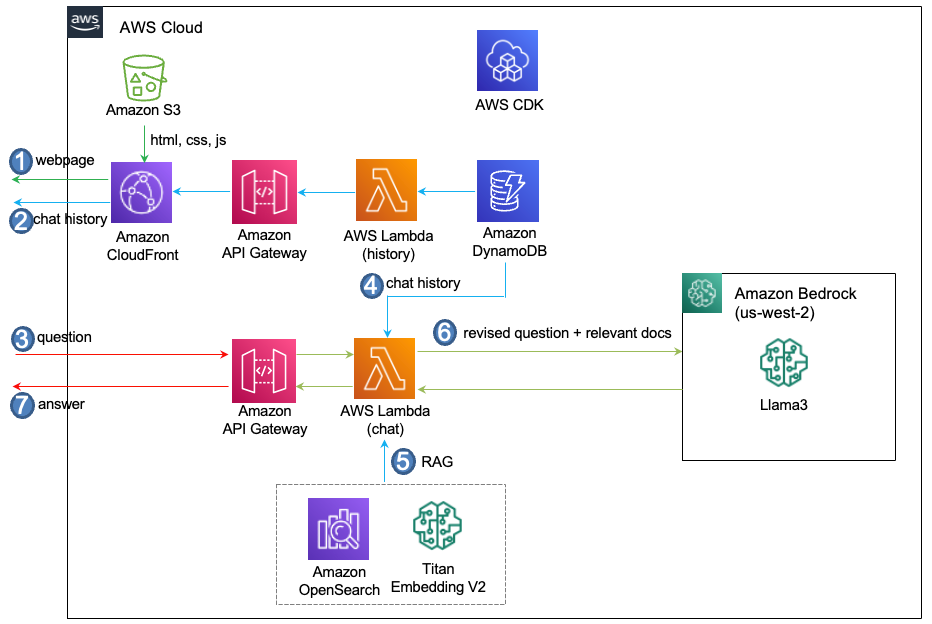

# Llama3로 RAG를 구현하기 

Llama3를 이용해 RAG를 구현하는 과정을 설명합니다. 여기에서는 Advanced RAG에서 성능 향상을 위해 활용되는 parent/child chunking, lexical/semantic 검색등이 포함되어 있습니다. 전체적인 Architecture는 아래와 같습니다.

1) 브라우저를 이용하여 CloudFront의 Domain로 접속하면 S3에 있는 html, css, js를 이용해 채팅화면 UI를 구성합니다.
2) 사용자가 userId를 넣고 접속하면, DynamoDB에 저장된 과거의 채팅이력을 조회하여 화면에 표시합니다.
3) 사용자가 채팅창에서 메시지를 입력하면 메시지는 WebSocket을 지원하는 API-Gateway를 통해 Lambda (chat)에 전달됩니다.
4) Lambda(chat)은 userId로 된 채팅이력이 있는지 조회하여 로드합니다.
5) 채팅 이력과 현재의 질문을 조합하여 새로운 질문을 만든후에, Embedding후 Vector store인 OpenSearch에 조회합니다.
6) 새로운 질문(Revised Question)과 RAG로 얻어진 관련된 문서들(Relevant documents)를 context로 Llama3 LLM에 답변을 요청합니다.
7) Llama3가 생성한 답변은 Lambda (chat)과 API Gateway를 거쳐서 Client에 Websocket으로 전달됩니다. 




## Architecture의 구현 


### LangChain을 이용한 Bedrock 설정

LangChain의 [ChatBedrock](https://python.langchain.com/v0.2/docs/integrations/chat/bedrock/)로 API을 이용합니다.

```python
boto3_bedrock = boto3.client(
    service_name='bedrock-runtime',
    region_name=bedrock_region,
    config=Config(
        retries = {
            'max_attempts': 30
        }
    )
)
parameters = {
    "max_gen_len": 1024,  
    "top_p": 0.9, 
    "temperature": 0.1
}    

chat = ChatBedrock(   
    model_id=modelId,
    client=boto3_bedrock, 
    model_kwargs=parameters,
)
```

### Basic Chat

Prompt를 이용해 chatbot의 이름과 Role을 지정할 수 있습니다. Chat history는 MessagesPlaceholder()를 이용해 반영합니다.


```python
def general_conversation(connectionId, requestId, chat, query):
    if isKorean(query)==True :
        system = (
            "다음의 Human과 Assistant의 친근한 이전 대화입니다. Assistant은 상황에 맞는 구체적인 세부 정보를 충분히 제공합니다. Assistant의 이름은 서연이고, 모르는 질문을 받으면 솔직히 모른다고 말합니다. 답변은 한국어로 합니다."
        )
    else: 
        system = (
            "Using the following conversation, answer friendly for the newest question. If you don't know the answer, just say that you don't know, don't try to make up an answer. You will be acting as a thoughtful advisor."
        )
    
    human = "{input}"
    
    prompt = ChatPromptTemplate.from_messages([("system", system), MessagesPlaceholder(variable_name="history"), ("human", human)])
    
    history = memory_chain.load_memory_variables({})["chat_history"]
                
    chain = prompt | chat    
    try: 
        isTyping(connectionId, requestId)  
        stream = chain.invoke(
            {
                "history": history,
                "input": query,
            }
        )
        msg = readStreamMsg(connectionId, requestId, stream.content)    
                            
        msg = stream.content
        print('msg: ', msg)
    except Exception:
        err_msg = traceback.format_exc()
        print('error message: ', err_msg)        
        
    return msg
```

여기서 Stream은 아래와 같이 event를 추출하여 json format으로 client에 결과를 전달합니다. 

```python
def readStreamMsg(connectionId, requestId, stream):
    msg = ""
    if stream:
        for event in stream:
            msg = msg + event

            result = {
                'request_id': requestId,
                'msg': msg,
                'status': 'proceeding'
            }
            sendMessage(connectionId, result)
    return msg
```

### 대화 이력의 관리

사용자가 접속하면, DynamoDB에서 대화 이력을 가져옵니다. 이것은 최초 접속 1회만 수행합니다. 

```python
def load_chat_history(userId, allowTime):
    dynamodb_client = boto3.client('dynamodb')

    response = dynamodb_client.query(
        TableName=callLogTableName,
        KeyConditionExpression='user_id = :userId AND request_time > :allowTime',
        ExpressionAttributeValues={
            ':userId': {'S': userId},
            ':allowTime': {'S': allowTime}
        }
    )


```

Context에 넣을 history를 가져와서 memory_chain에 등록합니다.

```pytho
for item in response['Items']:
    text = item['body']['S']
    msg = item['msg']['S']
    type = item['type']['S']

    if type == 'text' and text and msg:
        memory_chain.chat_memory.add_user_message(text)
        if len(msg) > MSG_LENGTH:
            memory_chain.chat_memory.add_ai_message(msg[:MSG_LENGTH])                          
        else:
            memory_chain.chat_memory.add_ai_message(msg) 
```

Lambda와 같은 서버리스는 이벤트가 있을 경우에만 사용이 가능하므로, 이벤트의 userId를 기준으로 메모리를 관리합니다. 

map_chain = dict()

```python
if userId in map_chain:  
    memory_chain = map_chain[userId]    
else: 
    memory_chain = ConversationBufferWindowMemory(memory_key="chat_history", output_key='answer’,
              return_messages=True, k=10)
    map_chain[userId] = memory_chain
```

새로운 입력(text)과 응답(msg)를 user/ai message로 저장합니다.

```python
memory_chain.chat_memory.add_user_message(text)
memory_chain.chat_memory.add_ai_message(msg)
```

### WebSocket Stream 사용하기 

#### Client 동작

WebSocket을 연결하기 위하여 endpoint를 접속을 수행합니다. onmessage()로 메시지를 받습니다. WebSocket이 연결되면 onopen()로 초기화를 수행합니다. 일정 간격으로 keep alive 동작을 수행합니다. 네트워크 재접속 등의 이유로 세션이 끊어지면 onclose()로 확인할 수 있습니다.

```python
const ws = new WebSocket(endpoint);
ws.onmessage = function (event) {        
    response = JSON.parse(event.data)

    if(response.request_id) {
        addReceivedMessage(response.request_id, response.msg);
    }
};
ws.onopen = function () {
    isConnected = true;
    if(type == 'initial')
        setInterval(ping, 57000); 
};
ws.onclose = function () {
    isConnected = false;
    ws.close();
};
```

발신 메시지는 JSON 포맷으로 아래와 같이 userId, 요청시간, 메시지 타입과 메시지를 포함합니다. 발신시 WebSocket의 send()을 이용하여 발신합니다. 발신시점에 세션이 연결되어 있지 않다면 연결하고 재시도하도록 알림을 표시합니다.

```python
sendMessage({
    "user_id": userId,
    "request_id": requestId,
    "request_time": requestTime,        
    "type": "text",
    "body": message.value
})
WebSocket = connect(endpoint, 'initial');
function sendMessage(message) {
    if(!isConnected) {
        WebSocket = connect(endpoint, 'reconnect');        
        addNotifyMessage("재연결중입니다. 잠시후 다시시도하세요.");
    }
    else {
        WebSocket.send(JSON.stringify(message));     
    }     
}
```

#### Server 동작

Client로 부터 메시지 수신은 Lambda로 전달된 event에서 connectionId와 routeKey를 이용해 수행합니다. 이때 keep alive 동작을 수행하여 세션을 유지합니다. 메시지 발신은 boto3로 "apigatewaymanagementapi"로 client를 정의한 후에 client.post_to_connection()로 전송합니다.

```python
connection_url = os.environ.get('connection_url')
client = boto3.client('apigatewaymanagementapi’,      
        endpoint_url=connection_url)

def sendMessage(id, body):
    try:
        client.post_to_connection(
            ConnectionId=id, 
            Data=json.dumps(body)
        )
    except Exception:
        err_msg = traceback.format_exc()
        print('err_msg: ', err_msg)
        raise Exception ("Not able to send a message")

def lambda_handler(event, context):
    if event['requestContext']: 
        connectionId = event['requestContext']['connectionId']        
        routeKey = event['requestContext']['routeKey']
        
        if routeKey == '$connect':
            print('connected!')
        elif routeKey == '$disconnect':
            print('disconnected!')
        else:
            body = event.get("body", "")
            if body[0:8] == "__ping__":  # keep alive
                sendMessage(connectionId, "__pong__")
            else:
                msg, reference = getResponse(connectionId, jsonBody)
```

### Prompt 사용 예: 번역하기

Prompt Engineering을 이용하여 손쉽게 한/영 번역을 수행합니다.

```python
def translate_text(chat, text):
    system = (
        "You are a helpful assistant that translates {input_language} to 
         {output_language} in <article> tags. Put it in <result> tags."
    )
    human = "<article>{text}</article>"
    
    prompt = ChatPromptTemplate.from_messages([("system", system), ("human", human)])
    
    if isKorean(text)==False :
        input_language = "English"
        output_language = "Korean"
    else:
        input_language = "Korean"
        output_language = "English"
```

Input/output 언어 타입과 입력 텍스트를 지정 후 chain.invoke()를 이용합니다.

```python
    chain = prompt | chat    
    result = chain.invoke(
        {
            "input_language": input_language,
            "output_language": output_language,
            "text": text,
        }
    )
        
    msg = result.content
    return msg[msg.find('<result>')+8:len(msg)-9] # remove <result> tag
```


### Prompt 사용 예: 문법 오류 고치기

Prompt Engineering을 이용해서 한/영 문법 오류 고치는 API를 만들 수 있습니다.

```python
def check_grammer(chat, text):
    if isKorean(text)==True:
        system = (
            "다음의 <article> tag안의 문장의 오류를 찾아서 설명하고, 오류가 수정된 문장을 답변 마지막에 추가하여 주세요."
        )
    else: 
        system = (
            "Here is pieces of article, contained in <article> tags. Find the error in the sentence and explain it, and add the corrected sentence at the end of your answer."
        )
        
    human = "<article>{text}</article>"
    
    prompt = ChatPromptTemplate.from_messages([("system", system), ("human", human)])
```    

### Prompt 사용 예: 코드 요약하기

Prompt Engineering을 이용해서 코드 요약하기 API를 만들 수 있습니다.

```python
def summary_of_code(chat, code, mode):
    if mode == 'py':
        system = (
            "다음의 <article> tag에는 python code가 있습니다. code의 전반적인 목적에 대해 설명하고, 각 함수의 기능과 역할을 자세하게 한국어 500자 이내로 설명하세요."
        )
    elif mode == 'js':
        system = (
            "다음의 <article> tag에는 node.js code가 있습니다. code의 전반적인 목적에 대해 설명하고, 각 함수의 기능과 역할을 자세하게 한국어 500자 이내로 설명하세요."
        )
    
    human = "<article>{code}</article>"
    
    prompt = ChatPromptTemplate.from_messages([("system", system), ("human", human)])
```

### RAG

RAG에서는 context tag를 이용해 Relevant Documents를 넣도록  Prompt를 구성합니다. 

```python
def query_using_RAG_context(connectionId, requestId, chat, context, revised_question):    
    system = (
            """다음의 <context> tag안의 참고자료를 이용하여 상황에 맞는 구체적인 세부 정보를 충분히 제공합니다. Assistant의 이름은 서연이고, 모르는 질문을 받으면 솔직히 모른다고 말합니다.
            
            <context>
            {context}
            </context>"""
        )
    
    human = "{input}"
    
    prompt = ChatPromptTemplate.from_messages([("system", system), ("human", human)])
```

History를 이용한 revised question과 Stream을 활용해서 성능 및 사용성을 높입니다.

```python
    chain = prompt | chat
    
    stream = chain.invoke(
        {
            "context": context,
            "input": revised_question,
        }
    )
    msg = readStreamMsg(connectionId, requestId, 
            stream.content)    

    return msg
```

OpenSearch를 이용해 Vector Store를 정의하고, 읽어온 문서를 등록합니다.

```python
def store_document_for_opensearch(bedrock_embeddings, docs, documentId):
        delete_document_if_exist(metadata_key)

        vectorstore = OpenSearchVectorSearch(
            index_name=index_name,  
            is_aoss = False,
            #engine="faiss",  # default: nmslib
            embedding_function = bedrock_embeddings,
            opensearch_url = opensearch_url,
            http_auth=(opensearch_account, opensearch_passwd),
        )
        response = vectorstore.add_documents(docs, bulk_size = 2000)
```

Vectorstore를 통해 관련된 문서를 추출하여 context로 활용합니다.

```python
# vector search (semantic) 
    relevant_documents = vectorstore_opensearch.similarity_search_with_score(
        query = query,
        k = top_k,
    )
relevant_docs = [] 
if(len(rel_docs)>=1):
        for doc in rel_docs:
            relevant_docs.append(doc)

    for document in relevant_docs:
        content = document['metadata']['excerpt']
                
        relevant_context = relevant_context + content + "\n\n"

msg = query_using_RAG_context(connectionId, requestId, chat, relevant_context, revised_question)
```

### RAG의 Parent/Child Chunking

문서를 크기에 따라 parent chunk와 child chunk로 나누어서 child chunk를 찾은 후에 LLM의 context에는 parent chunk를 사용하면, 검색의 정확도는 높이고 충분한 문서를 context로 활용할 수 있습니다. RAG의 검색정확도를 향상시키기 위한 여러가지 방법중에 Parent/Child Chunking을 이용할 수 있습니다. [parent-document-retrieval.md](https://github.com/kyopark2014/korean-chatbot-using-amazon-bedrock/blob/main/parent-document-retrieval.md)에서는 Parent/child로 chunking 전략에 대해 설명하고 있습니다.

```python
parent_splitter = RecursiveCharacterTextSplitter(
    chunk_size=2000,
    chunk_overlap=100,
    separators=["\n\n", "\n", ".", " ", ""],
    length_function = len,
)
child_splitter = RecursiveCharacterTextSplitter(
    chunk_size=400,
    chunk_overlap=50,
    # separators=["\n\n", "\n", ".", " ", ""],
    length_function = len,
)
```

Parent/Child Chunking을 수행하는 과정은 아래와 같습니다. 

1) parent/child로 chunking을 수행합니다.

2) parent doc을 OpenSearch에 add하면, parent_doc_id가 생성됩니다. 

3) child doc의 meta에 parent_doc_id를 등록합니다.
  
4) 문서 검색시, 필터를 이용해 child 문서를 검색합니다.
  
5) 검색된 child 문서들이 parent가 동일하다면 중복을 제거합니다.
  
6) parent_doc_id를 이용하여 OpenSearch에서 parent doc을 가져와 context로 활용합니다. 

Parent chunk의 meta에 “doc_level”을 “parent”로 지정하고 OpenSearch에 등록합니다. 

```python
parent_docs = parent_splitter.split_documents(docs)
    if len(parent_docs):
        for i, doc in enumerate(parent_docs):
            doc.metadata["doc_level"] = "parent"
                    
        parent_doc_ids = vectorstore.add_documents(parent_docs, bulk_size = 10000)
```

Child chunk의 meta에 “doc_level”을 “child”로 지정하고 “parent_doc_id”로 parent chunk의 document id를 지정합니다. 

```python                
        child_docs = []
        for i, doc in enumerate(parent_docs):
            _id = parent_doc_ids[i]
            sub_docs = child_splitter.split_documents([doc])
            for _doc in sub_docs:
                _doc.metadata["parent_doc_id"] = _id
                _doc.metadata["doc_level"] = "child"
            child_docs.extend(sub_docs)
                
        child_doc_ids = vectorstore.add_documents(child_docs, bulk_size = 10000)
                    
        ids = parent_doc_ids+child_doc_ids
```

OpenSearch에 RAG 정보를 요청할 때에 아래와 같이 pre_filter로 doc_level이 child인 문서들을 검색합니다. 

```python
def get_documents_from_opensearch(vectorstore_opensearch, query, top_k):
    result = vectorstore_opensearch.similarity_search_with_score(
        query = query,
        k = top_k*2,  
        pre_filter={"doc_level": {"$eq": "child"}}
    )
            
    relevant_documents = []
    docList = []
    for re in result:
        if 'parent_doc_id' in re[0].metadata:
            parent_doc_id = re[0].metadata['parent_doc_id']
            doc_level = re[0].metadata['doc_level']
```

Child chunk의 parent_doc_id가 중복이 아닌 경우만 relevant_document로 활용합니다. 

```python
      
            if doc_level == 'child':
                if parent_doc_id in docList:
                    print('duplicated!')
                else:
                    relevant_documents.append(re)
                    docList.append(parent_doc_id)
                    
                    if len(relevant_documents)>=top_k:
                        break
                                
return relevant_documents
```

OpenSearch에서 parent doc의 가져와서 RAG에서 활용합니다.

```python
relevant_documents = get_documents_from_opensearch(vectorstore_opensearch, keyword, top_k)

for i, document in enumerate(relevant_documents):
    parent_doc_id = document[0].metadata['parent_doc_id']
    doc_level = document[0].metadata['doc_level']        
    excerpt, uri = get_parent_document(parent_doc_id) # use pareant document

def get_parent_document(parent_doc_id):
    response = os_client.get(
        index="idx-rag", 
        id = parent_doc_id
    )
    
    source = response['_source']                                
    metadata = source['metadata']    
    return source['text'], metadata['uri']
```

Meta 파일을 생성하면 문서 업데이트나 삭제시 유용하게 사용할 수 있습니다.

```python
def create_metadata(bucket, key, meta_prefix, s3_prefix, uri, category, documentId, ids):
    title = key
    timestamp = int(time.time())

    metadata = {
        "Attributes": {
            "_category": category,
            "_source_uri": uri,
            "_version": str(timestamp),
            "_language_code": "ko"
        },
        "Title": title,
        "DocumentId": documentId,      
        "ids": ids  
    }
    
    objectName = (key[key.find(s3_prefix)+len(s3_prefix)+1:len(key)])

    client = boto3.client('s3')
    try: 
        client.put_object(
            Body=json.dumps(metadata), 
            Bucket=bucket, 
            Key=meta_prefix+objectName+'.metadata.json' 
        )
    except Exception:
        err_msg = traceback.format_exc()
        print('error message: ', err_msg)        
        raise Exception ("Not able to create meta file")
```

문서를 삭제하거나 업데이트 할 때에 OpenSearch의 문서를 삭제합니다. 

```python
def delete_document_if_exist(metadata_key):
    try: 
        s3r = boto3.resource("s3")
        bucket = s3r.Bucket(s3_bucket)
        objs = list(bucket.objects.filter(Prefix=metadata_key))
        
        if(len(objs)>0):
            doc = s3r.Object(s3_bucket, metadata_key)
            meta = doc.get()['Body'].read().decode('utf-8')
            
            ids = json.loads(meta)['ids']

            result = vectorstore.delete(ids) 
        else:
            print('no meta file: ', metadata_key)
```

### RAG의 파일 업로드

S3에 Object 업로드시 발생하는 이벤트 형태에는 OBJECT_CREATED_PUT (일반파일), CREATED_COMPLETE_MULTIPART_UPLOAD (대용량 파일)이 있습니다.

```python
const s3PutEventSource = new lambdaEventSources.S3EventSource(s3Bucket, {
    events: [
      s3.EventType.OBJECT_CREATED_PUT,
      s3.EventType.OBJECT_REMOVED_DELETE,
      s3.EventType.OBJECT_CREATED_COMPLETE_MULTIPART_UPLOAD
    ],
    filters: [
      { prefix: s3_prefix+'/' },
    ]
  });
  lambdaS3eventManager.addEventSource(s3PutEventSource);
```

### RAG의 결과를 신뢰도에 따라 정렬하기

FAISS를 이용해 일정 신뢰도 이상만을 관련된 문서로 활용합니다. 

```python
if len(relevant_docs) >= 1:
    selected_relevant_docs = priority_search(revised_question, relevant_docs, bedrock_embeddings)

def priority_search(query, relevant_docs, bedrock_embeddings):
    excerpts = []
    for i, doc in enumerate(relevant_docs):
        excerpts.append(
            Document(
                page_content=doc['metadata']['excerpt'],
                metadata={
                    'name': doc['metadata']['title'],
                    'order':i,
                }
            )
        )  

    embeddings = bedrock_embeddings
    vectorstore_confidence = FAISS.from_documents(
        excerpts,  # documents
        embeddings  # embeddings
    )            
    rel_documents = 
        vectorstore_confidence.similarity_search_with_score(
             query=query,
             k=top_k
        )
    docs = []
    for i, document in enumerate(rel_documents):
        order = document[0].metadata['order']
        name = document[0].metadata['name']
        assessed_score = document[1]

        relevant_docs[order]['assessed_score'] = int(assessed_score)

        if assessed_score < 200:
            docs.append(relevant_docs[order])    
    return docs
```

### LangChain Agent

ChatBedrock의 Llama3를 지원하고 있지만 Agent는 아직 지원하고 있지 않습니다. 관련 에러는 아래와 같습니다. 

```text
for chunk in self._prepare_input_and_invoke_stream(
File "/var/lang/lib/python3.11/site-packages/langchain_aws/llms/bedrock.py", line 756, in _prepare_input_and_invoke_stream
raise ValueError(
ValueError: Stop sequence key name for meta is not supported.
```

관련 이슈는 아래와 같습니다.

[Stop sequence key name for meta is not supported](https://github.com/langchain-ai/langchain/issues/19220)

[Error : Stop sequence key name for {meta or mistral or any other mode} is not supported](https://github.com/langchain-ai/langchain/issues/20053)

## 직접 실습 해보기

### 사전 준비 사항

이 솔루션을 사용하기 위해서는 사전에 아래와 같은 준비가 되어야 합니다.

- [AWS Account 생성](https://repost.aws/ko/knowledge-center/create-and-activate-aws-account)

### CDK를 이용한 인프라 설치

본 실습에서는 Oregon 리전 (us-west-2)을 사용합니다. [인프라 설치](./deployment.md)에 따라 CDK로 인프라 설치를 진행합니다. 

### 실행 결과

#### 기본 채팅

메뉴에서 "General Conversation"을 선택하고 먼저 "나는 여행을 좋아해"라고 입력한 후에, 다시 아래처럼 "서울"이라고 입력합니다. 대화 이력을 활용하였기 때문에 "서울"이라는 질문에 서울 여행과 관련된 대화를 수행합니다.  Llama3는 아직 [multilingual을 공식적으로 지원하지 않고 있어](https://ai.meta.com/blog/meta-llama-3/), 일부 부족한 면이 있으나 어느정도 수준의 한국어를 지원하고 있습니다. 


브라우저에서 뒤로가기를 선택하여 아래와 같이 Conversation Type을 "4. Translation"로 선택합니다. 


이후, "경주는 우리나라의 역사적인 도시입니다. 경주는 신라왕조의 수도였으며, 많은 문화유산을 가지고 있습니다. 경주에는 다양한 관광지가 있습니다. 불국사는 유네스코 세계문화유산으로 지정된 사찰입니다. 이 곳에는 많은 문화재가 있습니다. 둘째, 석굴암은 불국사와 함께 유네스코 세계문화유산으로 지정된 석굴입니다. 이 곳에는 많은 불상이 있습니다. 셋째, 경주歴史公園은 경주의 역사적인 문화유산을 느낄 수 있는 곳입니다. 이 곳에는 안압지, 첨성대, 황룡사지 등이 있습니다. 넷째, 양동마을은 전통한옥마을로 옛날의 모습을 그대로 간직하고 있습니다. 경주에는 역사적인 문화유산이 많아 역사에 관심이 있는 분들에게 추천합니다. 또한, 경주는 자연경관도 아름답습니다. 경주를 방문하여 다양한 경험을 하실 수 있습니다."라고 입력합니다. 이때의 번역 결과는 아래와 같습니다.


메뉴에서 "5. Grammatical Error Correction"을 선택합니다. 이후 "Gyeongju are a historic city in our country. It were the capital of the Silla Kingdom and have many cultural heritages."로 입력후 결과를 확인합니다. 아래와 같이 잘못된 문법과 수정된 내용을 보여줍니다.


이제 RAG를 시험하기 위하여, 메뉴에서 아래처럼 "3. RAG-opensearch (hybrid)"을 선택합니다.


[error_code.pdf](./contents/error_code.pdf)을 다운로드 한 후에, 채팅창의 파일 아이콘을 선택하여 업로드를 하면 아래와 같이 파일 내용을 요약한 결과를 확인할 수 있습니다.


이제, 아래와 같이 "보일러 에러 코드에 대해 상세히 설명해줘."라고 입력한 후에 결과를 확인합니다.


결과의 아래쪽을 보면, 아래와 같이 OpenSearch의 Vector/Keyword 검색을 통해 결과가 얻어졌음을 알수 있습니다. 


[ReAct-SYNERGIZING REASONING AND ACTING IN LANGUAGE MODELS](https://arxiv.org/pdf/2210.03629)을 다운로드 한 후에 파일 아이콘을 선택하여 업로드하면 아래와 같이 요약 결과를 보여줍니다.


이제, "Tell me about KNOWLEDGE-INTENSIVE REASONING TASKS"을 입력하면 아래와 같이 간단히 설명해줍니다.


좀더 자세히 알기 위하여, 아래처럼 추가 질문을 하면 상세한 정보를 얻을 수 있습니다.


## 리소스 정리하기 

더이상 인프라를 사용하지 않는 경우에 아래처럼 모든 리소스를 삭제할 수 있습니다. 

1) [API Gateway Console](https://us-west-2.console.aws.amazon.com/apigateway/main/apis?region=us-west-2)로 접속하여 "api-chatbot-for-llama3-rag-workshop", "api-llama3-rag-workshop"을 삭제합니다.

2) [Cloud9 console](https://us-west-2.console.aws.amazon.com/cloud9control/home?region=us-west-2#/)에 접속하여 아래의 명령어로 전체 삭제를 합니다.

```text
cd ~/environment/llama3-rag-workshop/cdk-llama3-rag-workshop/ && cdk destroy --all
```


